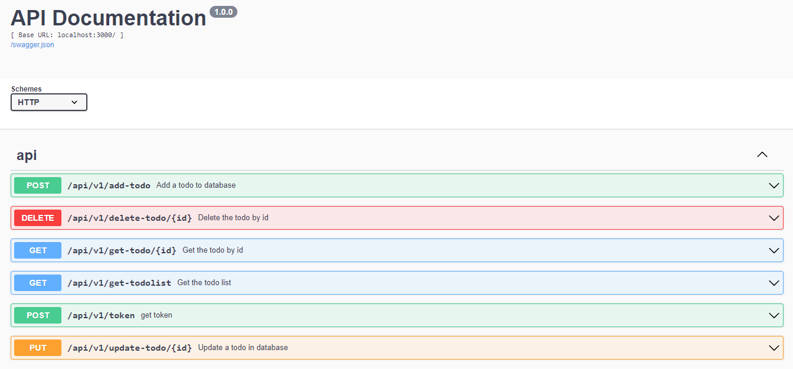

# node-hapi-api

Building a RESTful API with Node.js, Hapi, and MongoDB

**Description**:

Security is paramount when developing web applications, especially when handling user data and authentication. Node.js, in combination with the Hapi framework, offers a powerful platform for building secure and scalable RESTful APIs. When you add JWT (JSON Web Tokens) authentication and connect to a MongoDB database, you create a robust and flexible solution for protecting your API endpoints and managing user data.

**Node.js**: Node.js is a versatile server-side JavaScript runtime known for its speed and non-blocking I/O. It is an ideal choice for building high-performance APIs that can handle a large number of concurrent requests.

**Hapi**: Hapi is a feature-rich Node.js framework that simplifies the process of building APIs. It provides a set of tools for defining routes, request handling, validation, and authentication, making it an excellent choice for creating secure and well-structured RESTful services.

**JWT Authentication**: JSON Web Tokens (JWTs) are a widely adopted method for securing APIs. JWTs allow you to encode user information and session data into a token that can be sent with each API request. Hapi's authentication plugin can be configured to validate these tokens, ensuring that only authorized users can access protected resources.

**MongoDB**: MongoDB is a NoSQL database that stores data in flexible, JSON-like documents. It's an excellent choice for handling user profiles, access control lists, and other user-related data. MongoDB's scalability and speed make it a preferred database for modern web applications.

**API Documentation**

